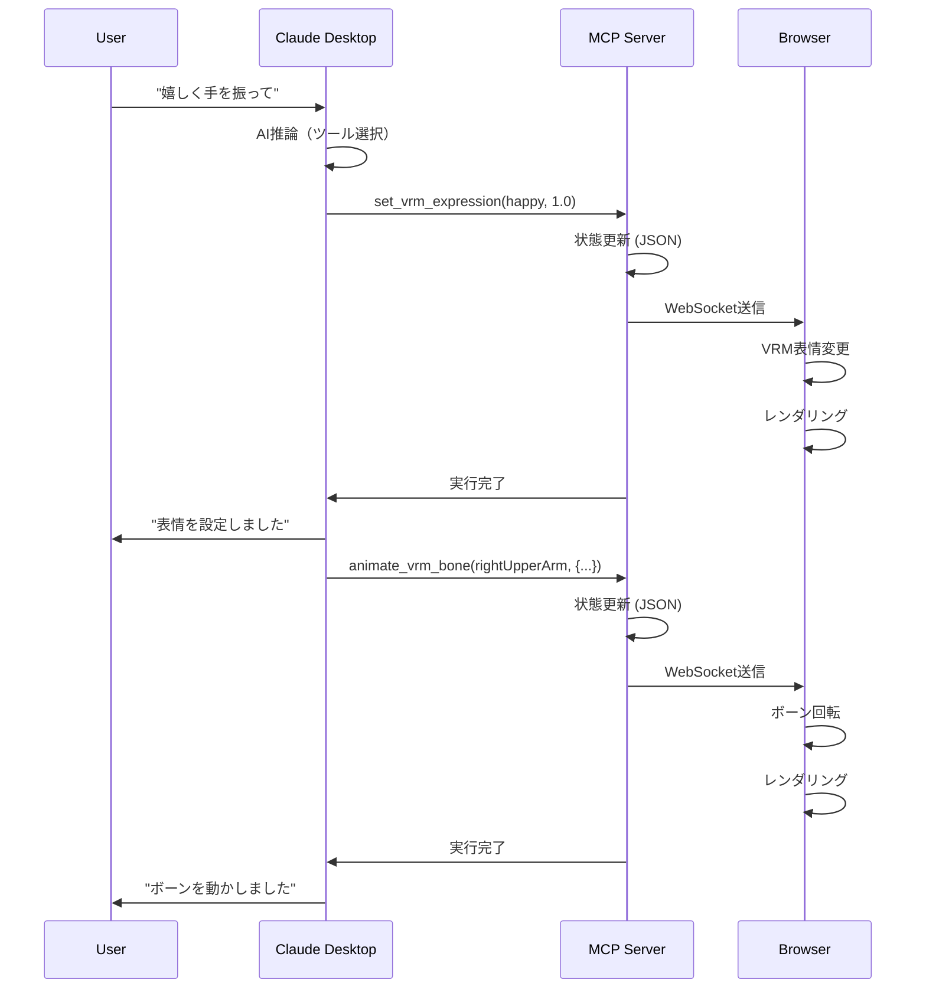

# VRM AI 制御システム アーキテクチャドキュメント

- 最終更新日: 2025/10/19

## 概要

このシステムは、Claude Desktop から自然言語で VRM モデルを制御し、Web ブラウザでリアルタイムに表示するシステムです。

**コンセプト**: 「AI に話しかけるだけで、VRM キャラクターが動く」

**重要**:

- ✅ **AI 推論は Claude Desktop が担当** - このサーバーに AI SDK は不要
- ✅ **MCP サーバーはツール提供のみ** - `@modelcontextprotocol/sdk` だけ使用

**主な機能**:

- ✅ VRM モデルの読み込み・表示
- ✅ 表情制御（ブレンドシェイプ）
- ✅ ボーン操作（個別制御）
- ✅ **VRMA アニメーション再生**（ループ・フェード対応）
- ✅ Claude Desktop からの自然言語制御

**必要な依存関係**:

```json
{
  "@modelcontextprotocol/sdk": "^0.5.0", // ← MCP通信のみ
  "express": "^4.18.2", // HTTPサーバー
  "ws": "^8.16.0" // WebSocket
}
// ❌ AI SDK（Gemini/OpenAI/Anthropic）は不要！
```

## システム全体像

```text
┌──────────────────┐
│ Claude Desktop   │ ユーザーが自然言語で指示
│ (local)          │ 例: "嬉しく手を振って"
└────────┬─────────┘
         │ stdio (MCP Protocol)
         ↓
┌──────────────────────────────┐
│ MCP Server (Node.js)         │ 1つのプロセスで3つの役割:
│ ┌──────────────────────────┐ │
│ │ 1. MCP Handler (stdio)   │ │ ← Claude Desktopと通信
│ │ 2. State Manager (JSON)  │ │ ← VRM状態を管理
│ │ 3. WebSocket Server      │ │ ← ブラウザと通信
│ └──────────────────────────┘ │
└─────────┬────────────────────┘
          │ WebSocket (ws://localhost:3000)
          ↓
┌──────────────────────────────┐
│ Web Browser                  │
│ ┌──────────────────────────┐ │
│ │ viewer.html              │ │ ← CDNからThree.js読み込み
│ │ - Three.js (WebGL)       │ │ ← リアルタイムレンダリング
│ │ - @pixiv/three-vrm       │ │ ← VRM表示・アニメーション
│ │ - WebSocket Client       │ │ ← コマンド受信
│ └──────────────────────────┘ │
└──────────────────────────────┘
```

## なぜこの構成？

### 🎯 **設計の核心**

#### **重要: AI 推論は Claude Desktop が担当**

```text
ユーザー: "嬉しい表情で手を振って"
  ↓
Claude Desktop (内蔵AI):
  - 自然言語を理解
  - 適切なツールを選択  ← ★ AIはここで動く！
  - ツールパラメータを生成
  ↓
MCP Server:
  - ツールを実行するだけ  ← AI推論はしない
  - VRMの状態を管理
  - ブラウザに転送
```

**つまり**:

- ❌ MCP サーバーに AI SDK（Gemini/OpenAI）は不要
- ✅ Claude Desktop が全部やってくれる
- ✅ MCP サーバーは「ツール提供者」に徹する

#### **Node.js で Three.js を使わない理由**

Node.js 上で Three.js を動かすと：

- ❌ ネイティブモジュール必要（Python/C++コンパイラ必須）
- ❌ 静的画像出力のみ（リアルタイム表示不可）

ブラウザで動かすと：

- ✅ インストール不要、CDN から直接
- ✅ WebGL ネイティブサポート
- ✅ 60FPS リアルタイム描画

#### **役割分担の明確化**

| Component          | 役割                  | 技術                | AI 推論   |
| ------------------ | --------------------- | ------------------- | --------- |
| **Claude Desktop** | AI 推論 + ツール選択  | MCP Protocol        | ✅ する   |
| **MCP Server**     | ツール実行 + 状態管理 | Node.js + WebSocket | ❌ しない |
| **Browser**        | VRM 表示              | Three.js (WebGL)    | ❌ しない |

## 詳細アーキテクチャ

### 1. ユーザーインターフェース層（Claude Desktop）

```text
ユーザー: "嬉しい表情で右手を振って"
   ↓
Claude Desktop
   ↓ (自然言語 → ツール呼び出しに変換)
   ↓
MCP Tool Calls:
  1. set_vrm_expression(expression="happy", weight=1.0)
  2. animate_vrm_bone(boneName="rightUpperArm", rotation={...})
```

**ポイント**: Claude Desktop が自動的にツールを選択・呼び出し

### 2. MCP Server 層（Node.js）

#### **3 つの役割を 1 プロセスで実現**

```typescript
import { Server } from "@modelcontextprotocol/sdk/server/index.js";
import { StdioServerTransport } from "@modelcontextprotocol/sdk/server/stdio.js";
import express from "express";
import { WebSocketServer } from "ws";
import { createServer } from "http";

class VRMMCPServer {
  private mcpServer: Server; // ① MCP通信
  private expressApp: express.Application; // ② HTTPサーバー
  private wss: WebSocketServer; // ③ WebSocket
  private vrmState: VRMState; // 状態管理（JSONのみ）

  constructor() {
    // ① MCPサーバー（stdio）
    this.mcpServer = new Server(
      { name: "vrm-mcp", version: "0.1.0" },
      { capabilities: { tools: {} } }
    );

    // ② Expressサーバー（HTTP）
    this.expressApp = express();
    const httpServer = createServer(this.expressApp);

    // 静的ファイル配信
    this.expressApp.use(express.static("public"));

    // ③ WebSocketサーバー
    this.wss = new WebSocketServer({ server: httpServer });

    // HTTPサーバー起動
    httpServer.listen(3000, () => {
      console.error("Web viewer: http://localhost:3000");
    });
  }

  async run() {
    // stdioでClaude Desktopと接続（ブロックしない）
    await this.mcpServer.connect(new StdioServerTransport());
  }
}
```

**なぜ 1 プロセスで可能？**

- Node.js はイベント駆動・非ブロッキング I/O
- stdio で待機中も、HTTP リクエストや WebSocket 通信を並行処理可能

#### **MCP ツール定義**

```typescript
// Claude Desktopから呼び出せるツール
const TOOLS = [
  {
    name: "load_vrm_model",
    description: "VRMモデルファイルを読み込む",
    inputSchema: {
      type: "object",
      properties: {
        filePath: {
          type: "string",
          description:
            "VRMファイル名（例: character.vrm）またはパス。環境変数 VRM_MODELS_DIR からの相対パス。",
        },
      },
      required: ["filePath"],
    },
  },
  {
    name: "set_vrm_expression",
    description: "VRMモデルの表情を設定する",
    inputSchema: {
      type: "object",
      properties: {
        expression: {
          type: "string",
          enum: ["happy", "angry", "sad", "surprised", "relaxed", "neutral"],
          description: "設定する表情",
        },
        weight: {
          type: "number",
          minimum: 0,
          maximum: 1,
          description: "表情の強さ (0.0-1.0)",
        },
      },
      required: ["expression", "weight"],
    },
  },
  {
    name: "set_vrm_pose",
    description: "VRMモデルの位置と回転を設定する",
    inputSchema: {
      type: "object",
      properties: {
        position: {
          type: "object",
          properties: {
            x: { type: "number" },
            y: { type: "number" },
            z: { type: "number" },
          },
        },
        rotation: {
          type: "object",
          properties: {
            x: { type: "number", description: "ラジアン" },
            y: { type: "number", description: "ラジアン" },
            z: { type: "number", description: "ラジアン" },
          },
        },
      },
    },
  },
  {
    name: "animate_vrm_bone",
    description: "指定されたボーンを回転させる",
    inputSchema: {
      type: "object",
      properties: {
        boneName: {
          type: "string",
          description:
            "ボーン名（例: leftUpperArm, rightUpperArm, head, spine）",
        },
        rotation: {
          type: "object",
          properties: {
            x: { type: "number" },
            y: { type: "number" },
            z: { type: "number" },
            w: { type: "number" },
          },
          description: "クォータニオン回転",
        },
      },
      required: ["boneName", "rotation"],
    },
  },
  {
    name: "get_vrm_status",
    description: "VRMモデルの現在の状態を取得する",
    inputSchema: {
      type: "object",
      properties: {},
    },
  },
  {
    name: "list_vrm_files",
    description:
      "利用可能なVRMモデルとVRMAアニメーションファイルの一覧を取得する",
    inputSchema: {
      type: "object",
      properties: {
        type: {
          type: "string",
          enum: ["models", "animations", "all"],
          description: "取得するファイルの種類（デフォルト: all）",
          default: "all",
        },
      },
    },
  },
  {
    name: "load_vrma_animation",
    description: "VRMAファイルからアニメーションを読み込む",
    inputSchema: {
      type: "object",
      properties: {
        animationPath: {
          type: "string",
          description:
            "VRMAファイル名（例: greeting.vrma）またはパス。環境変数 VRMA_ANIMATIONS_DIR からの相対パス。",
        },
        animationName: {
          type: "string",
          description: "アニメーション識別名（再生時に使用）",
        },
      },
      required: ["animationPath", "animationName"],
    },
  },
  {
    name: "play_vrma_animation",
    description: "読み込み済みのVRMAアニメーションを再生する",
    inputSchema: {
      type: "object",
      properties: {
        animationName: {
          type: "string",
          description: "再生するアニメーション名",
        },
        loop: {
          type: "boolean",
          description: "ループ再生するか",
          default: false,
        },
        fadeInDuration: {
          type: "number",
          description: "フェードイン時間（秒）",
          default: 0.3,
        },
      },
      required: ["animationName"],
    },
  },
  {
    name: "stop_vrma_animation",
    description: "再生中のVRMAアニメーションを停止する",
    inputSchema: {
      type: "object",
      properties: {
        fadeOutDuration: {
          type: "number",
          description: "フェードアウト時間（秒）",
          default: 0.3,
        },
      },
    },
  },
];
```

#### **環境変数の読み取り**

```typescript
// mcp-server.ts
import * as path from "path";
import * as fs from "fs/promises";

class VRMMCPServer {
  // 環境変数から読み取り（デフォルト値を設定）
  private vrmModelsDir: string;
  private vrmaAnimationsDir: string;
  private viewerPort: number;

  constructor() {
    // 環境変数 or デフォルトパス
    this.vrmModelsDir =
      process.env.VRM_MODELS_DIR || path.join(__dirname, "../public/models");

    this.vrmaAnimationsDir =
      process.env.VRMA_ANIMATIONS_DIR ||
      path.join(__dirname, "../public/animations");

    this.viewerPort = parseInt(process.env.VIEWER_PORT || "3000", 10);

    console.error(`VRM Models Dir: ${this.vrmModelsDir}`);
    console.error(`VRMA Animations Dir: ${this.vrmaAnimationsDir}`);

    // Express で静的配信
    this.expressApp.use("/models", express.static(this.vrmModelsDir));
    this.expressApp.use("/animations", express.static(this.vrmaAnimationsDir));
    this.expressApp.use(express.static("public")); // viewer.html
  }

  // ファイル一覧を取得
  private async listFiles(type: "models" | "animations" | "all"): Promise<any> {
    const result: any = {};

    if (type === "models" || type === "all") {
      try {
        const files = await fs.readdir(this.vrmModelsDir);
        result.models = files.filter((f) => f.endsWith(".vrm"));
      } catch (error) {
        result.models = [];
      }
    }

    if (type === "animations" || type === "all") {
      try {
        const files = await fs.readdir(this.vrmaAnimationsDir);
        result.animations = files.filter((f) => f.endsWith(".vrma"));
      } catch (error) {
        result.animations = [];
      }
    }

    return result;
  }
}
```

#### **状態管理（Three.js 不使用）**

```typescript
// Node.jsではThree.jsを使わず、JSONで状態管理
interface VRMState {
  modelPath: string | null;
  isLoaded: boolean;
  expressions: Map<string, number>; // 表情名 → 強さ
  pose: {
    position: { x: number; y: number; z: number };
    rotation: { x: number; y: number; z: number };
  };
  bones: Map<string, { x: number; y: number; z: number; w: number }>; // ボーン名 → クォータニオン
}

private vrmState: VRMState = {
  modelPath: null,
  isLoaded: false,
  expressions: new Map(),
  pose: {
    position: { x: 0, y: 0, z: 0 },
    rotation: { x: 0, y: 0, z: 0 }
  },
  bones: new Map()
};
```

#### **MCP ツール実行 → WebSocket ブロードキャスト**

```typescript
// Claude Desktopからツール呼び出し
this.mcpServer.setRequestHandler(CallToolRequestSchema, async (request) => {
  const { name, arguments: args } = request.params;

  // 1. 状態を更新
  switch (name) {
    case 'set_vrm_expression':
      this.vrmState.expressions.set(args.expression, args.weight);
      break;
    case 'animate_vrm_bone':
      this.vrmState.bones.set(args.boneName, args.rotation);
      break;
    // ...
  }

  // 2. 接続中の全ブラウザにブロードキャスト
  this.broadcast({
    type: name,
    data: args,
    timestamp: Date.now()
  });

  // 3. Claude Desktopに結果を返す
  return {
    content: [{
      type: 'text',
      text: `✓ ${name} を実行しました`
    }]
  };
});

// WebSocketブロードキャスト
private broadcast(message: any) {
  const data = JSON.stringify(message);
  this.connectedClients.forEach(client => {
    if (client.readyState === WebSocket.OPEN) {
      client.send(data);
    }
  });
}
```

### 3. Web Browser 層（Three.js + VRM）

#### **viewer.html（約 150 行：VRMA 対応版）**

```html
<!DOCTYPE html>
<html lang="ja">
  <head>
    <meta charset="UTF-8" />
    <title>VRM Viewer with VRMA Animation</title>
    <style>
      body {
        margin: 0;
        overflow: hidden;
      }
      #canvas {
        width: 100vw;
        height: 100vh;
      }
      #info {
        position: absolute;
        top: 10px;
        left: 10px;
        color: white;
        font-family: monospace;
        background: rgba(0, 0, 0, 0.7);
        padding: 10px;
        border-radius: 5px;
      }
    </style>
  </head>
  <body>
    <canvas id="canvas"></canvas>
    <div id="info">VRM Viewer (VRMA対応)</div>

    <script type="module">
      import * as THREE from "https://cdn.jsdelivr.net/npm/three@0.160.0/+esm";
      import {
        VRM,
        VRMLoaderPlugin,
      } from "https://cdn.jsdelivr.net/npm/@pixiv/three-vrm@2.0.7/+esm";
      import { GLTFLoader } from "https://cdn.jsdelivr.net/npm/three@0.160.0/examples/jsm/loaders/GLTFLoader.js";
      import {
        VRMAnimationLoaderPlugin,
        VRMAnimationClip,
        createVRMAnimationClip,
      } from "https://cdn.jsdelivr.net/npm/@pixiv/three-vrm-animation@0.1.1/+esm";

      // Three.js初期化
      const canvas = document.getElementById("canvas");
      const renderer = new THREE.WebGLRenderer({ canvas, antialias: true });
      renderer.setSize(window.innerWidth, window.innerHeight);
      renderer.setPixelRatio(window.devicePixelRatio);

      const scene = new THREE.Scene();
      scene.background = new THREE.Color(0x212121);

      const camera = new THREE.PerspectiveCamera(
        30,
        window.innerWidth / window.innerHeight,
        0.1,
        20
      );
      camera.position.set(0, 1.4, 3);

      const light = new THREE.DirectionalLight(0xffffff, Math.PI);
      light.position.set(1, 1, 1);
      scene.add(light);

      // VRM & アニメーション管理
      let vrm = null;
      let mixer = null; // THREE.AnimationMixer
      const loadedAnimations = new Map(); // animationName → AnimationClip
      let currentAction = null; // 再生中のAnimationAction

      // VRMローダー（VRMA対応）
      const loader = new GLTFLoader();
      loader.register((parser) => new VRMLoaderPlugin(parser));
      loader.register((parser) => new VRMAnimationLoaderPlugin(parser));

      // WebSocket接続
      const ws = new WebSocket("ws://localhost:3000");

      ws.onopen = () => {
        console.log("✓ WebSocket接続成功");
        document.getElementById("info").textContent =
          "✓ WebSocket接続成功 | VRMモデルを読み込んでください";
      };

      ws.onmessage = async (event) => {
        const message = JSON.parse(event.data);
        console.log("受信:", message);

        switch (message.type) {
          case "load_vrm_model":
            // VRMモデル読み込み
            const gltf = await loader.loadAsync(message.data.filePath);
            vrm = gltf.userData.vrm;
            scene.add(vrm.scene);

            // AnimationMixerを初期化
            mixer = new THREE.AnimationMixer(vrm.scene);

            console.log("✓ VRMモデル読み込み完了");
            document.getElementById("info").textContent =
              "✓ VRMモデル読み込み完了 | アニメーション可能";
            break;

          case "set_vrm_expression":
            // 表情設定
            if (vrm && vrm.expressionManager) {
              vrm.expressionManager.setValue(
                message.data.expression,
                message.data.weight
              );
            }
            break;

          case "animate_vrm_bone":
            // ボーンアニメーション
            if (vrm && vrm.humanoid) {
              const bone = vrm.humanoid.getNormalizedBoneNode(
                message.data.boneName
              );
              if (bone) {
                const { x, y, z, w } = message.data.rotation;
                bone.quaternion.set(x, y, z, w);
              }
            }
            break;

          case "set_vrm_pose":
            // ポーズ設定
            if (vrm) {
              if (message.data.position) {
                const { x, y, z } = message.data.position;
                vrm.scene.position.set(x, y, z);
              }
              if (message.data.rotation) {
                const { x, y, z } = message.data.rotation;
                vrm.scene.rotation.set(x, y, z);
              }
            }
            break;

          case "load_vrma_animation":
            // VRMAアニメーション読み込み
            if (!vrm) {
              console.error("VRMモデルが読み込まれていません");
              break;
            }

            try {
              const gltf = await loader.loadAsync(message.data.animationPath);
              const vrmAnimations = gltf.userData.vrmAnimations;

              if (vrmAnimations && vrmAnimations.length > 0) {
                // VRMAから AnimationClip を作成
                const clip = createVRMAnimationClip(vrmAnimations[0], vrm);
                loadedAnimations.set(message.data.animationName, clip);
                console.log(
                  `✓ VRMAアニメーション読み込み: ${message.data.animationName}`
                );
                document.getElementById(
                  "info"
                ).textContent = `✓ アニメーション読み込み: ${message.data.animationName}`;
              }
            } catch (error) {
              console.error("VRMA読み込みエラー:", error);
            }
            break;

          case "play_vrma_animation":
            // VRMAアニメーション再生
            if (!vrm || !mixer) {
              console.error("VRMモデルまたはMixerが初期化されていません");
              break;
            }

            const clip = loadedAnimations.get(message.data.animationName);
            if (!clip) {
              console.error(
                `アニメーション "${message.data.animationName}" が見つかりません`
              );
              break;
            }

            // 既存のアニメーションを停止
            if (currentAction) {
              currentAction.fadeOut(message.data.fadeInDuration || 0.3);
            }

            // 新しいアニメーションを再生
            currentAction = mixer.clipAction(clip);
            currentAction.reset();
            currentAction.fadeIn(message.data.fadeInDuration || 0.3);
            currentAction.setLoop(
              message.data.loop ? THREE.LoopRepeat : THREE.LoopOnce
            );

            if (!message.data.loop) {
              currentAction.clampWhenFinished = true;
            }

            currentAction.play();
            console.log(`▶ アニメーション再生: ${message.data.animationName}`);
            document.getElementById(
              "info"
            ).textContent = `▶ 再生中: ${message.data.animationName}`;
            break;

          case "stop_vrma_animation":
            // アニメーション停止
            if (currentAction) {
              currentAction.fadeOut(message.data.fadeOutDuration || 0.3);
              setTimeout(() => {
                currentAction.stop();
                currentAction = null;
                document.getElementById("info").textContent =
                  "⏹ アニメーション停止";
              }, (message.data.fadeOutDuration || 0.3) * 1000);
            }
            break;
        }
      };

      // アニメーションループ
      const clock = new THREE.Clock();

      function animate() {
        requestAnimationFrame(animate);

        const deltaTime = clock.getDelta();

        // VRMアップデート
        if (vrm) {
          vrm.update(deltaTime);
        }

        // AnimationMixerアップデート（VRMA再生用）
        if (mixer) {
          mixer.update(deltaTime);
        }

        renderer.render(scene, camera);
      }

      animate();

      // ウィンドウリサイズ対応
      window.addEventListener("resize", () => {
        camera.aspect = window.innerWidth / window.innerHeight;
        camera.updateProjectionMatrix();
        renderer.setSize(window.innerWidth, window.innerHeight);
      });
    </script>
  </body>
</html>
```

**ポイント**:

- ✅ **ビルド不要**: CDN から直接読み込み（Three.js + @pixiv/three-vrm + @pixiv/three-vrm-animation）
- ✅ **WebSocket**: リアルタイムコマンド受信
- ✅ **VRMA 対応**: VRMA ファイルの読み込み・再生に完全対応
- ✅ **AnimationMixer**: Three.js の標準機能でアニメーション管理
- ✅ **フェードイン/アウト**: 滑らかなアニメーション遷移

## データフロー

### **ユーザー操作の流れ**



### **システム起動の流れ**

````markdown
1. VRM/VRMA ファイルを配置

   ```sh
   # 好きな場所に配置（例）
   mkdir -p ~/Documents/MyVRMs/{models,animations}
   cp your-character.vrm ~/Documents/MyVRMs/models/
   cp your-animation.vrma ~/Documents/MyVRMs/animations/
   ```

2. Claude Desktop の設定ファイルを編集

   ~/Library/Application Support/Claude/claude_desktop_config.json

   ```json
   {
     "mcpServers": {
       "vrm-control": {
         "command": "node",
         "args": ["/path/to/vrm-mcp/dist/mcp-server.js"],
         "env": {
           "VRM_MODELS_DIR": "/Users/your-name/Documents/MyVRMs/models",
           "VRMA_ANIMATIONS_DIR": "/Users/your-name/Documents/MyVRMs/animations"
         }
       }
     }
   }
   ```

3. Claude Desktop を起動
   → 自動的に MCP Server が起動
   → stdio で接続確立
   → HTTP サーバー起動（ポート 3000）
   → ツール一覧を取得

4. ブラウザでアクセス
   http://localhost:3000
   → viewer.html を表示
   → WebSocket で MCP Server に接続
   → VRM モデル読み込み待機

5. Claude Desktop でファイル名を確認
   "どんな VRM モデルがある？"
   → AI が VRM_MODELS_DIR 内のファイル一覧を表示

6. ユーザーが指示
   "character.vrm を読み込んで"
   → Claude Desktop → MCP Server → Browser
   → VRM 表示

7. アニメーション指示
   "greeting.vrma を読み込んで、嬉しい表情で再生して"
   → Claude Desktop → MCP Server → Browser
   → リアルタイムで VRM が動く
````

## プロジェクト構造

```sh
vrm-mcp/
├── src/
│   └── mcp-server.ts          # MCPサーバー実装（約400行）
├── public/
│   └── viewer.html            # VRMビューア（約150行）
├── package.json
├── tsconfig.json
└── README.md

# VRM/VRMAファイルは任意の場所に配置可能！
# 例: ユーザーのドキュメントフォルダ
~/Documents/MyVRMs/
├── models/
│   ├── character.vrm
│   ├── character2.vrm
│   └── avatar.vrm
└── animations/
    ├── greeting.vrma
    ├── wave.vrma
    ├── dance.vrma
    └── bow.vrma
```

### **VRM/VRMA ファイルの配置方法**

#### **方法 1: 環境変数で任意のディレクトリを指定（推奨）✨**

Claude Desktop の設定ファイルで環境変数を指定すると、**好きな場所**に VRM/VRMA ファイルを配置できます！

```json
// ~/Library/Application Support/Claude/claude_desktop_config.json
{
  "mcpServers": {
    "vrm-control": {
      "command": "node",
      "args": ["/Users/lvncer/GitRepos/vrm-mcp/dist/mcp-server.js"],
      "env": {
        "VRM_MODELS_DIR": "/Users/lvncer/Documents/MyVRMs/models",
        "VRMA_ANIMATIONS_DIR": "/Users/lvncer/Documents/MyVRMs/animations",
        "VIEWER_PORT": "3000"
      }
    }
  }
}
```

**メリット**:

- ✅ **柔軟**: VRM/VRMA を好きな場所に置ける
- ✅ **簡単**: MCP サーバーのプロジェクト内部を触る必要なし
- ✅ **複数プロジェクト共有**: 既存の VRM コレクションをそのまま使える
- ✅ **設定ファイルだけで管理**: ファイルコピー不要

**MCP サーバー側の実装**:

```typescript
// mcp-server.ts
const vrmModelsDir =
  process.env.VRM_MODELS_DIR || path.join(__dirname, "../public/models");
const vrmaAnimationsDir =
  process.env.VRMA_ANIMATIONS_DIR ||
  path.join(__dirname, "../public/animations");
const port = parseInt(process.env.VIEWER_PORT || "3000", 10);

// 環境変数で指定されたディレクトリを静的配信
this.expressApp.use("/models", express.static(vrmModelsDir));
this.expressApp.use("/animations", express.static(vrmaAnimationsDir));
this.expressApp.use(express.static("public")); // viewer.html
```

**使用例**:

```typescript
// Claude Desktop から指示
"キャラクターを読み込んで"
  ↓
Tool: load_vrm_model
Args: { filePath: "character.vrm" }  // ← ファイル名だけでOK！
  ↓
MCP Server: `${VRM_MODELS_DIR}/character.vrm` を配信
  ↓
Browser: http://localhost:3000/models/character.vrm を読み込み
```

#### **方法 2: プロジェクト内に配置（デフォルト）**

環境変数を設定しない場合は、プロジェクト内の `public/` に配置：

```sh
vrm-mcp/
└── public/
    ├── models/
    │   └── character.vrm
    └── animations/
        └── greeting.vrma
```

**こちらも動作しますが、ファイルを手動コピーする必要があります。**

### **必要な依存関係**

```json
{
  "name": "vrm-mcp",
  "version": "0.1.0",
  "type": "module",
  "scripts": {
    "build": "tsc",
    "start": "node dist/mcp-server.js"
  },
  "dependencies": {
    "@modelcontextprotocol/sdk": "^0.5.0",
    "express": "^4.18.2",
    "ws": "^8.16.0"
  },
  "devDependencies": {
    "@types/express": "^4.17.21",
    "@types/node": "^20.11.0",
    "@types/ws": "^8.5.10",
    "typescript": "^5.3.3"
  }
}
```

**注意**: Three.js と@pixiv/three-vrm は`package.json`に**不要**（CDN から読み込み）

### **Claude Desktop 設定（完全版）**

```json
// ~/Library/Application Support/Claude/claude_desktop_config.json
{
  "mcpServers": {
    "vrm-control": {
      "command": "node",
      "args": ["/Users/lvncer/GitRepos/vrm-mcp/dist/mcp-server.js"],
      "env": {
        "VRM_MODELS_DIR": "/Users/lvncer/Documents/MyVRMs/models",
        "VRMA_ANIMATIONS_DIR": "/Users/lvncer/Documents/MyVRMs/animations",
        "VIEWER_PORT": "3000"
      }
    }
  }
}
```

**環境変数の説明**:

| 環境変数              | 説明                                          | デフォルト値          |
| --------------------- | --------------------------------------------- | --------------------- |
| `VRM_MODELS_DIR`      | VRM モデルファイルの配置ディレクトリ          | `./public/models`     |
| `VRMA_ANIMATIONS_DIR` | VRMA アニメーションファイルの配置ディレクトリ | `./public/animations` |
| `VIEWER_PORT`         | Web ビューアのポート番号                      | `3000`                |

**環境変数を省略した場合**:

```json
{
  "mcpServers": {
    "vrm-control": {
      "command": "node",
      "args": ["/Users/lvncer/GitRepos/vrm-mcp/dist/mcp-server.js"]
    }
  }
}
```

→ デフォルトで `vrm-mcp/public/models/` と `vrm-mcp/public/animations/` を使用

## 実装例

### **完全なワークフロー**

#### **ステップ 1: VRM モデル読み込み**

```text
User → Claude Desktop:
  "VRMモデル ./models/character.vrm を読み込んで"

Claude Desktop → MCP Server:
  Tool: load_vrm_model
  Args: { filePath: "./models/character.vrm" }

MCP Server:
  1. ファイル存在確認
  2. 状態更新: vrmState.modelPath = "./models/character.vrm"
  3. WebSocket送信 → Browser

Browser:
  1. GLTFLoader で VRM 読み込み
  2. Three.js シーンに追加
  3. レンダリング開始

MCP Server → Claude Desktop:
  "VRMモデルを読み込みました"
```

#### **ステップ 2: 複合アニメーション**

```text
User → Claude Desktop:
  "嬉しい表情で右手を振って"

Claude Desktop (AI推論):
  → 2つのツールを順次実行

Tool 1: set_vrm_expression
  Args: { expression: "happy", weight: 1.0 }
  → Browser: 表情変更

Tool 2: animate_vrm_bone
  Args: {
    boneName: "rightUpperArm",
    rotation: { x: 0, y: 0, z: -0.7071, w: 0.7071 } // 90度回転
  }
  → Browser: 右腕を上げる
```

### **具体的なツール呼び出し例**

```typescript
// 例1: 表情変更
await mcpClient.callTool("set_vrm_expression", {
  expression: "happy",
  weight: 1.0,
});
// → ブラウザで即座に反映

// 例2: ポーズ変更
await mcpClient.callTool("set_vrm_pose", {
  position: { x: 0, y: 0, z: 0 },
  rotation: { x: 0, y: Math.PI / 4, z: 0 }, // 45度回転
});
// → モデル全体が回転

// 例3: ボーンアニメーション
await mcpClient.callTool("animate_vrm_bone", {
  boneName: "head",
  rotation: { x: 0, y: 0, z: 0.2588, w: 0.9659 }, // 30度傾ける
});
// → 首を傾げる動作

// 例4: ファイル一覧取得
const files = await mcpClient.callTool("list_vrm_files", { type: "all" });
// 返り値:
// {
//   models: ["character.vrm", "character2.vrm", "avatar.vrm"],
//   animations: ["greeting.vrma", "wave.vrma", "dance.vrma", "bow.vrma"]
// }

// 例5: 状態確認
const status = await mcpClient.callTool("get_vrm_status", {});
// 返り値:
// {
//   isLoaded: true,
//   modelPath: "character.vrm",
//   currentExpressions: { "happy": 1.0 },
//   availableExpressions: ["happy", "angry", "sad", "surprised", "relaxed", "neutral"],
//   availableBones: ["head", "neck", "chest", "spine", "leftUpperArm", ...]
// }

// 例6: VRMAアニメーション読み込み
await mcpClient.callTool("load_vrma_animation", {
  animationPath: "greeting.vrma", // ← ファイル名だけでOK
  animationName: "greeting",
});
// → ブラウザでVRMAファイルを読み込み、メモリに保存

// 例7: VRMAアニメーション再生
await mcpClient.callTool("play_vrma_animation", {
  animationName: "greeting",
  loop: false,
  fadeInDuration: 0.5, // 0.5秒かけてフェードイン
});
// → 挨拶アニメーションを再生（1回のみ）

// 例8: ループ再生
await mcpClient.callTool("play_vrma_animation", {
  animationName: "dance",
  loop: true,
  fadeInDuration: 0.3,
});
// → ダンスアニメーションを永遠にループ

// 例9: アニメーション停止
await mcpClient.callTool("stop_vrma_animation", {
  fadeOutDuration: 1.0, // 1秒かけてフェードアウト
});
// → 再生中のアニメーションを滑らかに停止
```

### **VRMA アニメーションの実践例** [[memory:8390757]]

```typescript
// シナリオ: キャラクターが挨拶する

// 1. 利用可能なファイルを確認
const files = await mcpClient.callTool("list_vrm_files", { type: "all" });
// → { models: ["character.vrm", ...], animations: ["greeting.vrma", ...] }

// 2. VRMモデル読み込み
await mcpClient.callTool("load_vrm_model", {
  filePath: "character.vrm", // ← 環境変数 VRM_MODELS_DIR からの相対パス
});

// 3. 挨拶アニメーション読み込み
await mcpClient.callTool("load_vrma_animation", {
  animationPath: "greeting.vrma", // ← 環境変数 VRMA_ANIMATIONS_DIR からの相対パス
  animationName: "greeting",
});

// 4. 表情を笑顔にしてから
await mcpClient.callTool("set_vrm_expression", {
  expression: "happy",
  weight: 1.0,
});

// 5. 挨拶アニメーションを再生
await mcpClient.callTool("play_vrma_animation", {
  animationName: "greeting",
  loop: false,
  fadeInDuration: 0.3,
});

// → 笑顔で挨拶する動作が完成！
```

```typescript
// Claude Desktopでの自然言語操作例

// ユーザー: "どんなVRMモデルがある？"
// → AI が実行:
//   list_vrm_files(type="models")
//   → 「character.vrm、character2.vrm、avatar.vrm があります」

// ユーザー: "character.vrm を読み込んで"
// → AI が実行:
//   load_vrm_model(filePath="character.vrm")

// ユーザー: "どんなアニメーションがある？"
// → AI が実行:
//   list_vrm_files(type="animations")
//   → 「greeting.vrma、wave.vrma、dance.vrma、bow.vrma があります」

// ユーザー: "笑顔で挨拶して"
// → AI が以下を順次実行:
//   1. load_vrma_animation(animationPath="greeting.vrma", animationName="greeting")
//   2. set_vrm_expression(expression="happy", weight=1.0)
//   3. play_vrma_animation(animationName="greeting", loop=false)

// ユーザー: "ダンスを繰り返して"
// → AI が実行:
//   1. load_vrma_animation(animationPath="dance.vrma", animationName="dance")
//   2. play_vrma_animation(animationName="dance", loop=true)

// ユーザー: "止めて"
// → AI が実行:
//   stop_vrma_animation()
```

## 技術的詳細

### **なぜ WebSocket か？**

#### **HTTP vs WebSocket**

```typescript
// ❌ HTTPポーリング（非効率）
setInterval(async () => {
  const state = await fetch("http://localhost:3000/vrm-state").then((r) =>
    r.json()
  );
  // 1秒ごとにリクエスト → 遅延大、サーバー負荷高
}, 1000);

// ✅ WebSocket（双方向リアルタイム）
ws.onmessage = (event) => {
  const command = JSON.parse(event.data);
  // 即座に反映、遅延<10ms
};
```

**メリット**:

- 低遅延（<10ms）
- サーバープッシュ可能
- コネクション維持で効率的

### **Three.js のレンダリングループ**

```javascript
function animate() {
  requestAnimationFrame(animate); // ブラウザの描画タイミングに同期（60FPS）

  if (vrm) {
    vrm.update(clock.getDelta()); // VRMの内部状態更新（ブレンドシェイプ等）
  }

  renderer.render(scene, camera); // 実際の描画
}
```

**ポイント**:

- `requestAnimationFrame`: ブラウザの最適化に任せる
- `vrm.update()`: 表情のブレンドやスプリングボーン処理
- GPU 駆動なので CPU 負荷が低い

### **VRM ボーン名の規則**

```typescript
// VRM 1.0の標準ボーン名
const HUMANOID_BONES = [
  "hips",
  "spine",
  "chest",
  "upperChest",
  "neck",
  "head",
  "leftShoulder",
  "leftUpperArm",
  "leftLowerArm",
  "leftHand",
  "rightShoulder",
  "rightUpperArm",
  "rightLowerArm",
  "rightHand",
  "leftUpperLeg",
  "leftLowerLeg",
  "leftFoot",
  "rightUpperLeg",
  "rightLowerLeg",
  "rightFoot",
  // ... 他にも指や目のボーン
];

// 使用例
vrm.humanoid.getNormalizedBoneNode("rightUpperArm"); // 右上腕
```

### **表情プリセット**

```typescript
// VRM標準表情
const STANDARD_EXPRESSIONS = [
  "neutral", // 通常
  "happy", // 嬉しい
  "angry", // 怒り
  "sad", // 悲しい
  "relaxed", // リラックス
  "surprised", // 驚き
  "blink", // 瞬き
  "blinkLeft", // 左瞬き
  "blinkRight", // 右瞬き
  // モデルによってはカスタム表情も
];

// 複数表情のブレンド
vrm.expressionManager.setValue("happy", 0.7);
vrm.expressionManager.setValue("surprised", 0.3);
// → 嬉しさ70% + 驚き30%
```

## 利点

### 🎯 **シンプルなアーキテクチャ**

- ファイル 2 つで動作（mcp-server.ts + viewer.html）
- ビルドツール最小限（TypeScript のみ）
- CDN 活用で npm 依存少ない

### 🚀 **リアルタイム性**

- WebSocket で低遅延通信（<10ms）
- ブラウザの WebGL で 60FPS 描画
- アニメーションが滑らか

### 🔧 **拡張性**

- 新しいツールを簡単に追加
- 複数ブラウザで同時視聴可能
- VRMA アニメーション対応も可能

### 🤖 **AI 自律制御**

- 自然言語 → 複数ツール呼び出し
- Claude Desktop が最適なツールを選択
- 複雑な動作も一度の指示で実行

### 📦 **環境非依存**

- Node.js だけあれば動作（ネイティブモジュール不要）
- ブラウザがあればクライアント不要
- macOS/Linux/Windows 全対応

## 今後の拡張可能性

### ✅ **既に実装済み**

- ✅ VRMA アニメーション読み込み・再生
- ✅ 表情制御（ブレンドシェイプ）
- ✅ ボーン操作
- ✅ リアルタイム WebSocket 通信

### 🎭 **高度な表情制御**

```typescript
// 表情の自動遷移（tweening）
{
  name: 'transition_expression',
  description: '表情を滑らかに遷移させる',
  parameters: {
    from: 'neutral',
    to: 'happy',
    duration: 2.0, // 2秒かけて遷移
    easing: 'easeInOutQuad' // イージング関数
  }
}

// 複数表情の同時ブレンド
{
  name: 'blend_expressions',
  description: '複数の表情を同時に設定',
  parameters: {
    expressions: [
      { name: 'happy', weight: 0.7 },
      { name: 'surprised', weight: 0.3 }
    ]
  }
}
```

### 🕺 **IK とプリセットモーション**

```typescript
// インバースキネマティクス（手の位置から腕を自動計算）
{
  name: 'set_hand_position',
  description: 'IKで手の位置を指定',
  parameters: {
    hand: 'left' | 'right',
    position: { x: 0.5, y: 1.2, z: 0.3 },
    lookAtTarget: true // 手を見る
  }
}

// プリセットモーション（VRMAなしで簡単な動き）
{
  name: 'play_preset_motion',
  description: 'プリセットモーションを再生',
  parameters: {
    preset: 'wave' | 'bow' | 'nod' | 'shrug' | 'clap',
    speed: 1.0 // 再生速度
  }
}
```

### 👥 **複数 VRM 制御**

```typescript
// 複数キャラクターの同時制御
{
  name: 'load_vrm_model',
  parameters: {
    filePath: './models/character2.vrm',
    characterId: 'character2', // ID指定
    position: { x: 2, y: 0, z: 0 } // 初期位置
  }
}
```

### 📹 **カメラ制御**

```typescript
// カメラアングル変更
{
  name: 'set_camera',
  description: 'カメラの位置と向きを設定',
  parameters: {
    position: { x: 1, y: 1.5, z: 2 },
    lookAt: { x: 0, y: 1.4, z: 0 }
  }
}
```

### 🗣️ **音声連携**

```typescript
// リップシンク
{
  name: 'play_audio_with_lipsync',
  description: '音声再生とリップシンク',
  parameters: {
    audioUrl: './audio/greeting.wav',
    autoLipSync: true // 自動リップシンク
  }
}
```

## トラブルシューティング

### **Q: ブラウザで VRM が表示されない**

```bash
# ブラウザのコンソールを確認
# CORSエラーの場合:
# → VRMファイルを public/ 配下に配置
# → または mcp-server.ts で CORS を有効化

app.use((req, res, next) => {
  res.header('Access-Control-Allow-Origin', '*');
  next();
});
```

### **Q: WebSocket 接続エラー**

```javascript
// ブラウザコンソールで確認
ws://localhost:3000 に接続できない
// → MCP Server が起動しているか確認
// → ポート3000が使用中でないか確認
```

### **Q: Claude Desktop からツールが見えない**

```bash
# claude_desktop_config.json のパスを確認
# macOS:
~/Library/Application Support/Claude/claude_desktop_config.json

# 設定後、Claude Desktop を再起動
```

## まとめ

このアーキテクチャにより、**「AI に話しかけるだけで、Web ブラウザで VRM キャラクターがリアルタイムに動く」**システムを、最小限のコードで実現できます。

### **核心の設計思想**

1. **Node.js = 状態管理 + 中継役**（Three.js は使わない）
2. **Browser = 描画専門**（CDN で Three.js 読み込み）
3. **WebSocket = 低遅延リアルタイム通信**
4. **MCP = Claude Desktop との標準インターフェース**

### **最小構成**

- **2 ファイルで動作**: `mcp-server.ts` + `viewer.html`
- **環境構築簡単**: Node.js + ブラウザのみ
- **拡張容易**: ツール追加が簡単

**このドキュメントを基に実装すれば、今日から VRM を AI 制御できます！** 🎉
