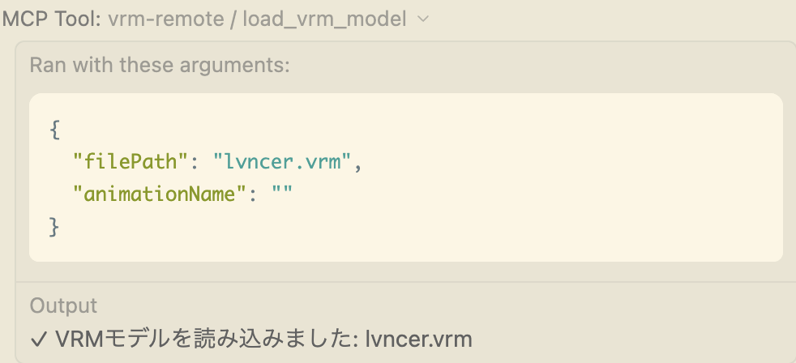
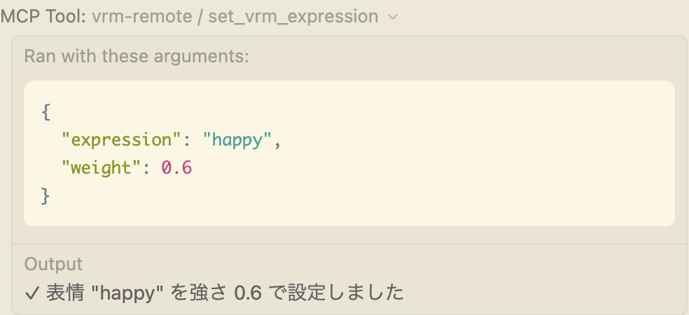
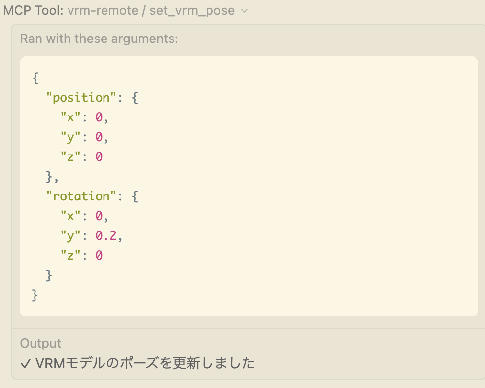

# Tool Usecases

| `list_vrm_files` | 利用可能な VRM/VRMA ファイル一覧 | 「どんな VRM がある？」 |
| `load_vrm_model` | VRM モデル読み込み | 「character.vrm を読み込んで」 |

| `set_vrm_expression` | 表情設定 | 「嬉しい表情にして」 |

| `set_vrm_pose` | ポーズ設定 | 「右を向いて」 |

| `animate_vrm_bone` | ボーン操作 | 「右手を上げて」 |
| `load_vrma_animation` | VRMA アニメーション読み込み | 「greeting.vrma を読み込んで」 |
| `play_vrma_animation` | アニメーション再生 | 「挨拶して」 |
| `stop_vrma_animation` | アニメーション停止 | 「止めて」 |
| `get_vrm_status` | 状態取得 | 「現在の状態は？」 |
